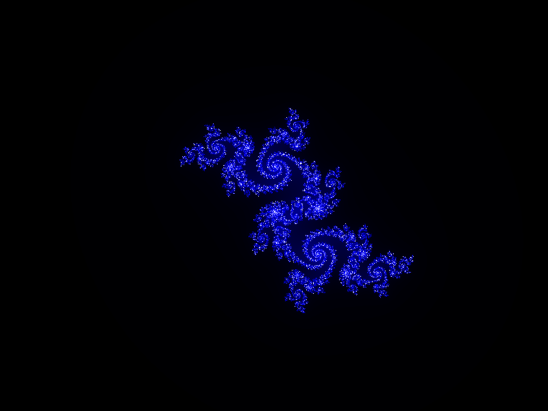

# Mandelbrot Julia Maker

这是一个绘制 Mandelbrot 和 Julia 集合的网页应用。它使用ECMAScript 6 编写，使用了webpack进行打包。最近把 dst 也加到了 git 仓库里面，如果用户本地没有 nodejs 环境无法打包的话，用浏览器访问 dst 里面的 index.html 就可以使用此工具了。下面是使用说明。

## Mandelbrot 集合

下面这张图片是计算 Mandelbrot 集合的发散速度生成的可视化图像。越白的地方，发散速度越慢。

> Mandelbrot 集合图像是一个定义在复数平面的函数公式的发散速度图像。这个函数的自变量取复平面不同位置的值的时候，函数值随着迭代变大的速度是不同的，将这个函数的发散速度绘制出来就是著名的 Mandelbrot 集图像了。所以，网页的图实际上是将像素换算成复数平面的位置，然后递归算出来的。

## Julia集合

将网页往下拉就会发现下面还有一张图片，这就是 Julia 集合。同样的道理，黑色是发散速度很快的地方。

> Julia 集的公式跟 Mandelbrot 是一样的，但是选取作为自变量的参数不是同一个。同理，Julia 集也是反复迭代算出来的，不同颜色反映了不同的发散速度。

下面这张图片是以 Mandelbrot 图像的一个位置作为控制参数算出来的。继续往下看就知道了，你可以通过选择 Mandelbrot 区域的方法控制生成的 Julia 图像。

> 有意思的是，整个 Julia 集合都包含在 Mandelbrot 集合里面——毕竟从数学角度看，它们都是同一个公式算出来的。也因为如此，Julia 集的图像跟选取的 Mandelbrot 集区域的图像有种难以表达的对称性。

## 控制生成的图像

### 1. 图像的放大

先不要点模式切换的按钮。在正常的模式下，我们将鼠标放在图像区域之内，然后按下左键不放并拖动，就会出现选择框：

选择一个黑白交接的边缘位置（因为其他地方要么是黑的，要么就是白的，没有图案），然后松开左键。在松开按键的时候，程序就会根据选择的位置重新绘制图像，放大你选中的区域。

> 可能等待的过程比较长，这个要看你电脑的 CPU 速度了。不足的地方是，我的程序没有利用多线程。一般笔记本的 CPU 在10 秒之内就可以算出结果了。

这种操作对 Julia 集的图像也是如此。

### 2. 指定 Julia 集控制参数的位置

前面有说到 Julia 集合的图像是以 Mandelbrot 集的一个位置作为控制参数算出来的，这里说明怎么操作可以指定这个位置。

回到网页上方的 Mandelbrot 集，点击进入选择模式按钮。

可以看到，按钮颜色变了，并且鼠标移到 Mandelbrot 图像内出现了十字准星。没错，现在可以点击一个黑白区域的交接点，这时程序就会以选中的点作为 Julia 集的控制参数绘制这个点对应的 Mandelbrot 集合的点的 Julia 集图像。

绘制过程同样有点慢，也是 10 秒内出结果，如果使用台式电脑的话估计很快就算好了。

## 着色方法

默认图像是这样子，黑白的，并不多姿多彩：

所以我这里弄了一些不同的着色算法，它们会以不同的方式来将发散速度换算成彩色像素值：

下面我通过截图来演示效果：

### 1. 伪彩色

截图有点丑，某些位置的图像会比较好看一点。

### 2. 黑蓝白

发散速度越慢，颜色越白。中间是蓝色的。

### 3. 彩虹

按照彩虹色来显示发散速度，越快的颜色越红，越慢的颜色越蓝，中间的是彩虹的颜色排布，两端又趋向黑色。

### 4. 彩虹反向

其实就是彩虹色，只是颜色顺序倒过来而已。

## 图像导出

点击导出就行了。这是一些用此工具绘制的图像：

最后，代码写得不好又没去整理，真是不好意思。